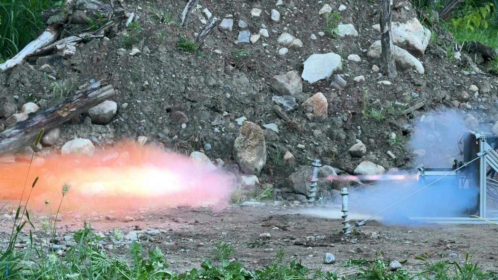

# MACH - TMU Liquid Rocketry Team

**Official website documenting liquid propulsion systems, avionics development, and test campaigns**

  

## SPRINT System in Action

*Advanced plumbing and fluid control systems for liquid rocket engine testing*

## LabVIEW Control Interface

*Real-time monitoring and control interface for test operations*

## Electronics Panel (EGSE)

*Electronics panel featuring PLC and control systems for test operations*

## Seraphina Hot Fire

*Seraphina hot fire on August 6th, 2026. Select the image for videos, telemetry, and downloadable data.*

