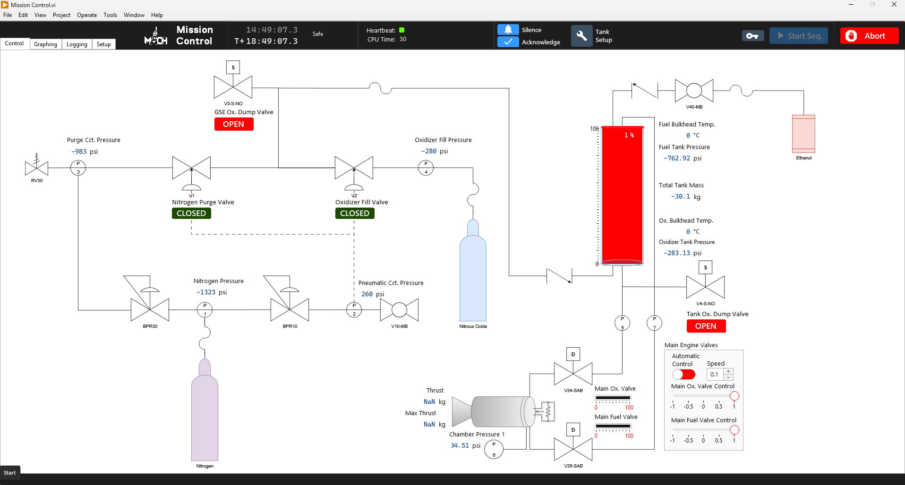
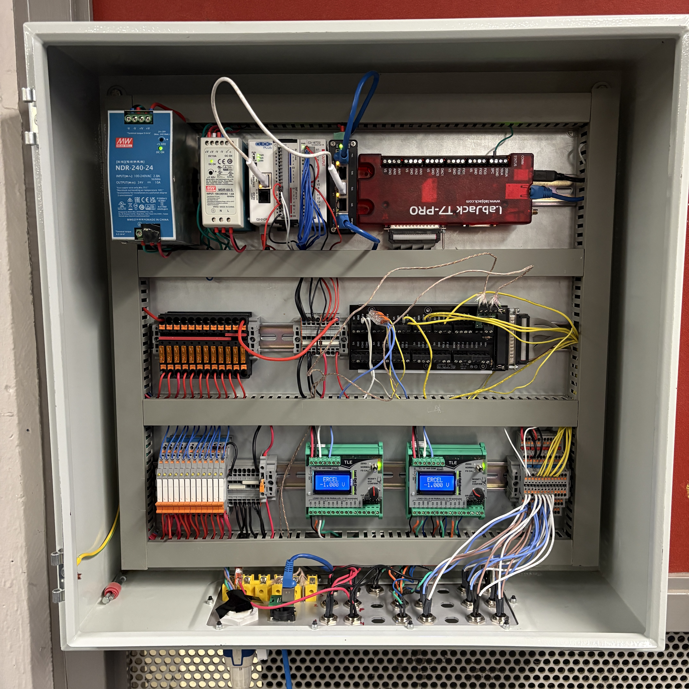

# MACH - TMU Liquid Rocketry Team

**Official website documenting liquid propulsion systems, avionics development, and test campaigns**

  

## SPRINT System in Action

*Advanced plumbing and fluid control systems for liquid rocket engine testing*

## LabVIEW Control Interface

*Real-time monitoring and control interface for test operations*

## Electronics Panel (EGSE)

*Electronics panel featuring PLC and control systems for test operations*

## Hot Fire Testing

*Live hot fire test footage of our liquid rocket engine*

---

  <picture>
    <source media="(prefers-color-scheme: dark)" srcset="https://raw.githubusercontent.com/zensical/zensical/master/.github/assets/zensical-dark.png">
    <source media="(prefers-color-scheme: light)" srcset="https://raw.githubusercontent.com/zensical/zensical/master/.github/assets/zensical.png">
    
  </picture>

