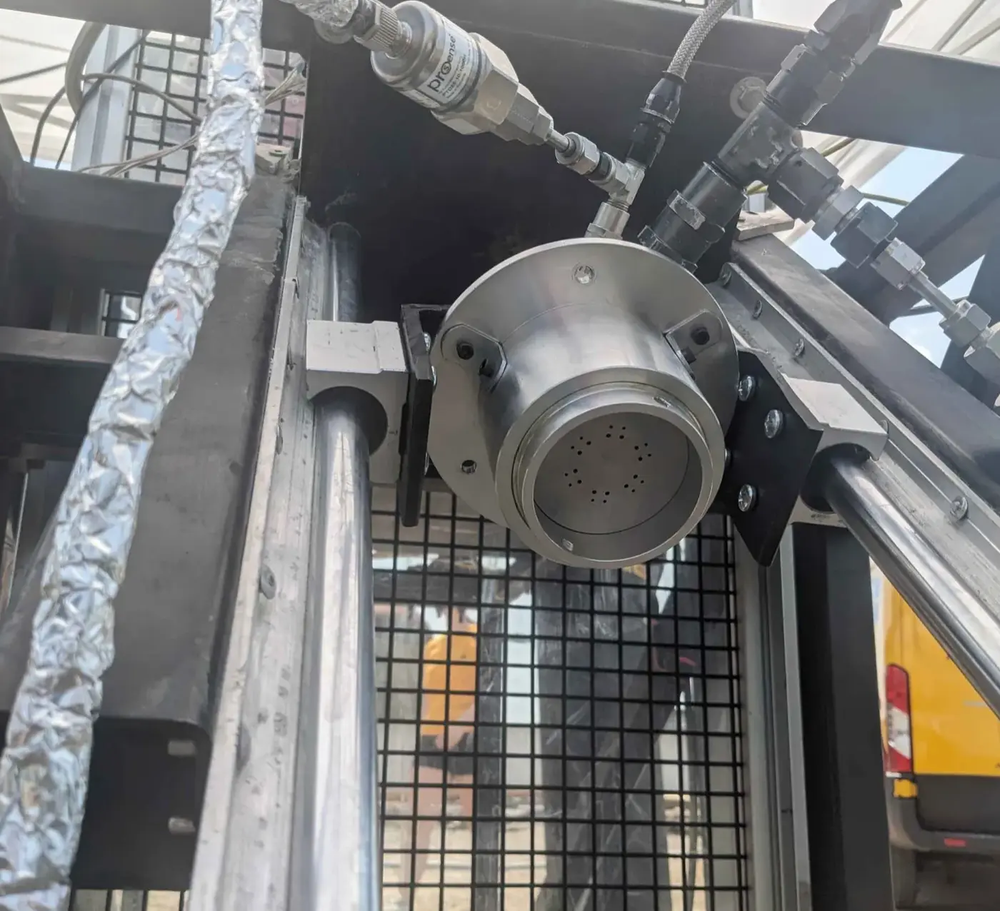

# New GAR-E Cold Flow Test - July 14th, 2024

Two inert flows through Spender and the New GAR-E injector were completed on July 14th. The test measured injector pressure drops and mass flow and recorded video of the fuel and oxidizer sprays. The telemetry and control system acquired the required data in both runs.

## Measurements

Fuel-injector pressure drop was repeatable at 106–108 psi. Its calculated discharge coefficient was 0.367, indicating excess pressure loss in the transition between the injector lid and fuel volute. The planned correction was a small change to the volute geometry followed by another pressure-drop measurement.

The first run did not produce an accurate initial fuel mass because of a load-cell problem. The second run discharged for 6.364 seconds at an average fuel mass flow of 0.189 kg/s. The fuel cavitating-venturi discharge coefficient was 0.856, compared with 0.860 in the earlier characterization.

Oxidizer-injector pressure drop ranged from 580 to 650 psi and measured mass flow was 0.53 kg/s. The report attributes the lower-than-target flow to the high ambient temperature and records the result as consistent with the calibrated fluid-system model.

## Spray observations

Valve timing was staggered to record 0.5 seconds of fuel-only impingement. Video showed visible fuel droplets from the New GAR-E injector. Its like-like oxidizer elements produced slower, more dispersed oxidizer-side jets than the original GAR-E injector. The report records all primary data-collection objectives as completed.

## Test Videos

  <figure style="margin:0; width:100%;">
    

      <iframe
        src="https://drive.google.com/file/d/1ISGnudQeO6_BOAiZ6cblaq2-5R4iSs4X/preview"
        title="New GAR-E cold-flow attempt 1"
        loading="lazy"
        allow="autoplay; encrypted-media; picture-in-picture"
        allowfullscreen
        style="position:absolute; inset:0; width:100%; height:100%; border:0;"
      ></iframe>
    

    <figcaption style="margin-top:0.75rem; text-align:center;">
      <strong>Attempt 1</strong> 
      <a href="https://drive.google.com/uc?export=download&amp;id=1ISGnudQeO6_BOAiZ6cblaq2-5R4iSs4X" class="md-button" target="_blank" rel="noopener">Download video</a>
    </figcaption>
  </figure>

  <figure style="margin:0; width:100%;">
    

      <iframe
        src="https://drive.google.com/file/d/1ClnNEUlACZLj3bKhQVOrUNiiIYDG3LWl/preview"
        title="New GAR-E cold-flow attempt 2"
        loading="lazy"
        allow="autoplay; encrypted-media; picture-in-picture"
        allowfullscreen
        style="position:absolute; inset:0; width:100%; height:100%; border:0;"
      ></iframe>
    

    <figcaption style="margin-top:0.75rem; text-align:center;">
      <strong>Attempt 2</strong> 
      <a href="https://drive.google.com/uc?export=download&amp;id=1ClnNEUlACZLj3bKhQVOrUNiiIYDG3LWl" class="md-button" target="_blank" rel="noopener">Download video</a>
    </figcaption>
  </figure>

## Test Summary and Data

The archived test summary contains the pressure plots and derived measurements. No raw CSV was found with this campaign.

  <a href="https://docs.google.com/presentation/d/11mXZSLYIwP8eB0nHSIcKfxVf1yld41Az0vT73EU2_rk/edit" class="md-button">Open Cold-Flow Summary</a>

<figure style="margin:2rem auto; display:flex; flex-direction:column; align-items:center; width:100%; text-align:center;">
  
</figure>

[Read the 2024 Launch Canada report](/resources/MACH_LCR2024.pdf#page=42){ .md-button }
