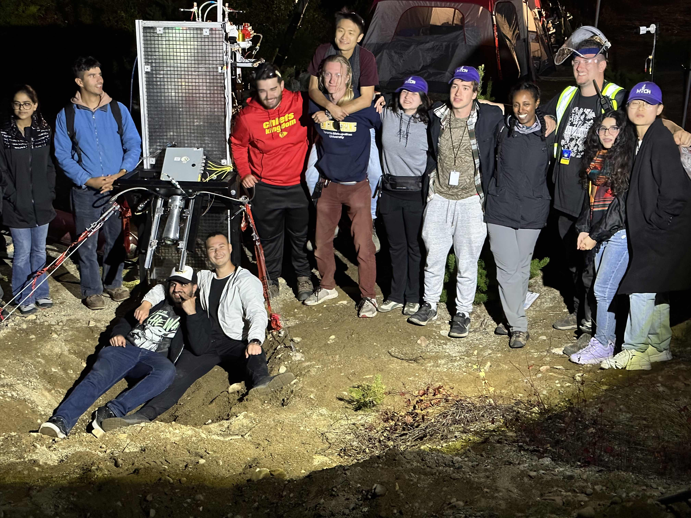

# GAR-E Hot Fire Attempt - August 30th, 2023

This was GAR-E's first hot-fire attempt at Launch Canada 2023. The attempt was unsuccessful.

## Test Video

<figure style="margin:2rem auto; display:flex; flex-direction:column; align-items:center; width:100%; text-align:center;">
  <video controls src="test-video.mov" title="GAR-E hot-fire attempt on August 30th, 2023" style="width:100%; max-width:800px; aspect-ratio:16/9; height:auto; border-radius:8px; display:block;"></video>
  <figcaption style="font-size:0.9rem; color:#888; margin-top:0.5rem;">GAR-E hot-fire attempt at Launch Canada 2023.</figcaption>
</figure>

## Team Photo

<figure style="margin:2rem auto; display:flex; flex-direction:column; align-items:center; width:100%; text-align:center;">
  
  <figcaption style="font-size:0.9rem; color:#888; margin-top:0.5rem;">GAR-E team with the test stand at Launch Canada 2023.</figcaption>
</figure>
