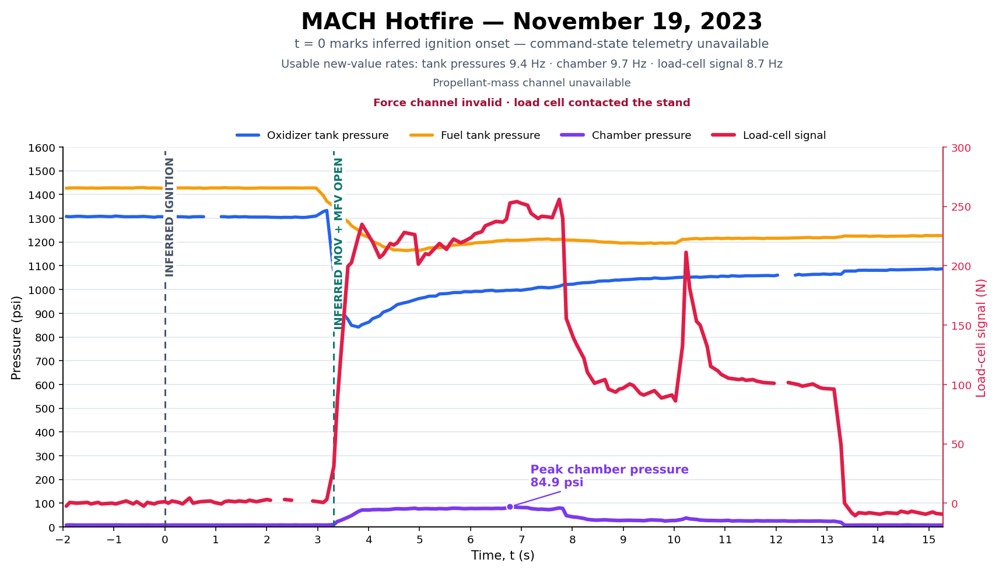
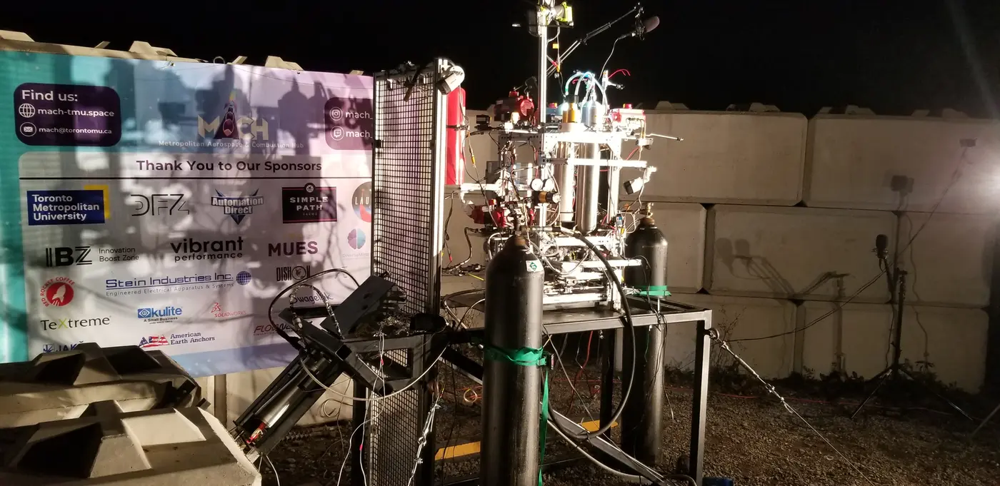

# GAR-E Hot Fire Attempt - November 19th, 2023

The November campaign included an ignition test and one hot-fire attempt. The gerb igniter lit propellant downstream, but the flame did not propagate into the chamber. Recorded chamber pressure reached approximately 80 psi; the test review attributed this to cold nitrous vapour rather than sustained combustion.

## Test Video

<figure style="margin:2rem auto; display:flex; flex-direction:column; align-items:center; width:100%; text-align:center;">
  <video controls preload="metadata" playsinline src="test-video.mp4" poster="test-video-poster.jpg" aria-label="GAR-E hot-fire attempt on November 19th, 2023" style="width:100%; max-width:800px; aspect-ratio:16/9; height:auto; border-radius:8px; display:block;"></video>
  <figcaption style="font-size:0.9rem; color:#888; margin-top:0.5rem;">GAR-E hot-fire attempt on November 19th, 2023.</figcaption>
</figure>

## Test Data

  <a href="https://drive.google.com/file/d/1DrHPtX4J_5HPq4gSO_25INygI3zVoa-V/view" class="md-button">Download Hot-Fire Data (.csv)</a>
  <a href="https://drive.google.com/file/d/1E5OBec5cdeFvXWLyNLt9L-lwVEslk760/view" class="md-button">Download Ignition Data (.csv)</a>
  <a href="https://docs.google.com/spreadsheets/d/1t0PlERdyHCYssTunOz1W_n3WGX8gIs_TXZPbVLsqyVE/edit" class="md-button">Open Data in Google Sheets</a>

## Burn Telemetry

<figure style="margin:2rem auto; display:flex; flex-direction:column; align-items:center; width:100%; text-align:center;">
  
  <figcaption style="font-size:0.9rem; color:#888; margin-top:0.5rem;">Raw measurements with consecutive duplicate values removed. Ignition and valve timing are inferred because command-state telemetry was not recorded.</figcaption>
</figure>

## Test Stand

<figure style="margin:2rem auto; display:flex; flex-direction:column; align-items:center; width:100%; text-align:center;">
  
</figure>
