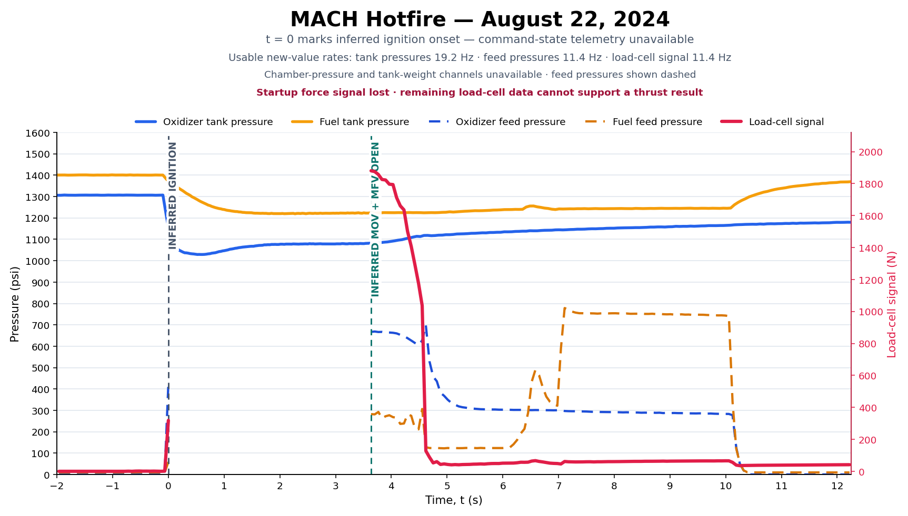

# New GAR-E Hot Fire Test - August 22nd, 2024

New GAR-E achieved MACH's first sustained in-chamber ethanol and nitrous oxide hot fire at Launch Canada 2024 on August 22nd.

## Attempt sequence

Two ignition attempts failed on August 20th. In the first, the gerb was expelled when the main valves opened and combustion occurred outside the chamber. The retention mechanism was changed before the second attempt. In that run the gerb fired, but the thermocouple did not reach the programmed threshold, so the main propellant valves remained closed.

The August 21st attempt combined a second igniter with a gerb. Video and a chamber-pressure spike showed brief ignition in the chamber, but combustion was not sustained. The ignition sequence was changed again before the August 22nd firing.

## Result

The August 22nd run produced sustained combustion in the chamber. Post-test inspection found burn-through immediately upstream of the throat. A separate injector review identified fuel maldistribution; adding a second fuel inlet was proposed for a later injector.

## Measurement limits

The chamber-pressure channel was invalid during the successful run. Startup thrust samples were also lost; the surviving force data covered the end of the burn, not the complete startup transient. Command-state telemetry was not recorded, so the ignition and valve times in the plot are inferred.

The force trace therefore cannot establish peak thrust or total impulse for this firing. A later PDR likewise states that the available GAR-E hot-fire thrust data did not have enough fidelity to determine thrust-coefficient efficiency.

## Test Video

<figure style="margin:2rem auto; display:flex; flex-direction:column; align-items:center; width:100%; text-align:center;">
  <video controls preload="metadata" playsinline src="gare-hotfire-2024-08-22.mp4" poster="test-video-poster.jpg" aria-label="GAR-E hot fire test on August 22nd, 2024" style="width:100%; max-width:1000px; aspect-ratio:16/9; height:auto; border-radius:8px; display:block;"></video>
  <figcaption style="font-size:0.9rem; color:#888; margin-top:0.5rem;">New GAR-E's sustained hot fire at Launch Canada on August 22nd, 2024.</figcaption>
</figure>

## Test Data

  <a href="https://drive.google.com/file/d/1ASg2F8EZFQp8-0I72Bn5lmzytgV82CjF/view" class="md-button">Download August 22nd Data (.zip)</a>
  <a href="https://drive.google.com/file/d/1uiEs12jRscL-hG__ARg9q2YMMdw4RZNj/view" class="md-button">Download LC2024 Data Dump (.zip)</a>

## Burn Telemetry

<figure style="margin:2rem auto; display:flex; flex-direction:column; align-items:center; width:100%; text-align:center;">
  
  <figcaption style="font-size:0.9rem; color:#888; margin-top:0.5rem;">The chamber-pressure channel was invalid, startup force samples were lost, and command-state telemetry was not recorded. Feed pressures replace chamber pressure, and event timing is inferred. The force trace does not support a peak-thrust value.</figcaption>
</figure>

## Team Photo

<figure style="margin:2rem auto; display:flex; flex-direction:column; align-items:center; width:100%; text-align:center;">
  
  <figcaption style="font-size:0.9rem; color:#888; margin-top:0.5rem;">New GAR-E team at Launch Canada on August 22nd, 2024.</figcaption>
</figure>

[Read the PDR performance-analysis limitation](/resources/machpdr2025.pdf#page=128){ .md-button }
