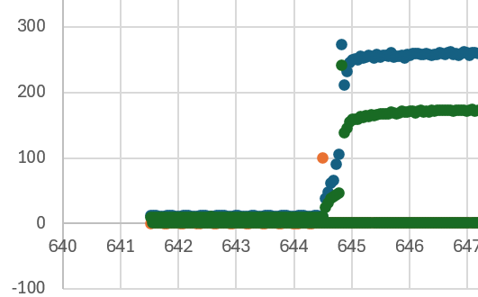
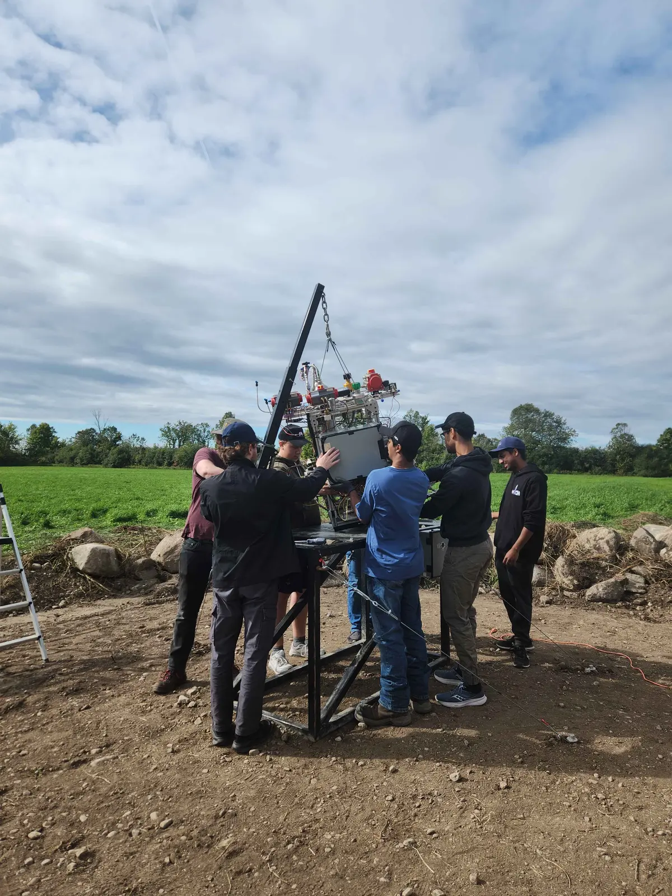
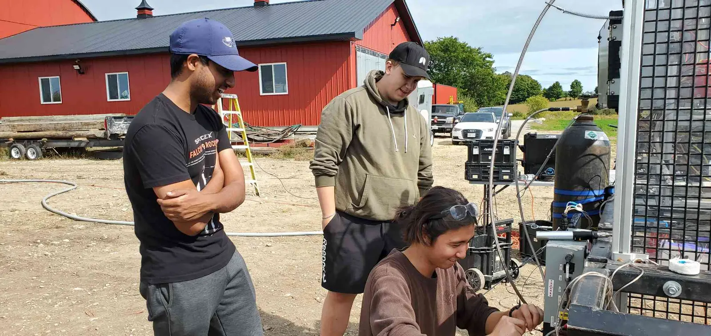
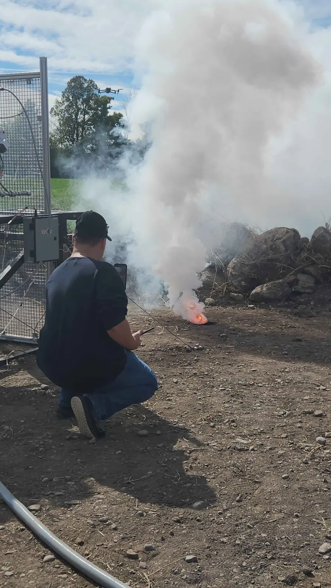
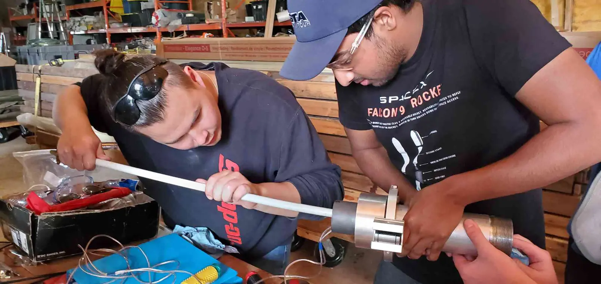
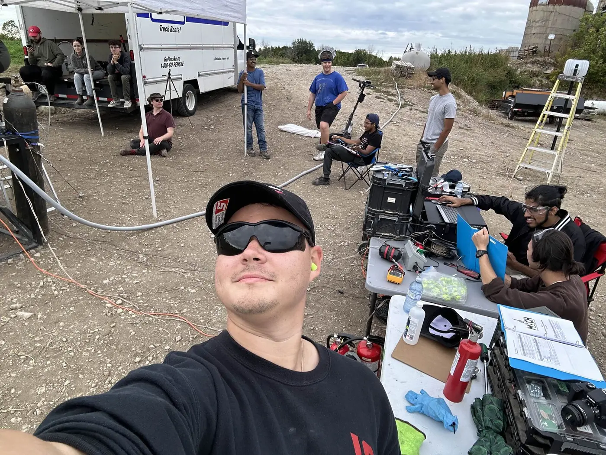

# GAR-E Hot Fire Test - September 29th, 2024

## Campaign chronology

The fully integrated RNX puck igniter fired successfully on September 28th. The team then proceeded to the system leak check. This was the preparation and igniter-test day, not the engine hot-fire date.

New GAR-E fired on September 29th. The flame anchored in the chamber and sustained combustion was established. Post-test analysis placed full ignition approximately 200 milliseconds after the main valves opened. The graphite nozzle remained in place during the initial flow and separated when full ignition occurred.

## Test Videos

  <figure style="margin:0;">
    <video controls preload="metadata" playsinline poster="gare-hotfire-2024-09-29-close-poster.webp" aria-label="Close side view of the GAR-E hot fire on September 29th, 2024" style="display:block; width:100%; aspect-ratio:16/9; object-fit:contain; background:#000; border-radius:8px;">
      <source src="gare-hotfire-2024-09-29-close.mp4" type="video/mp4">
      Your browser does not support embedded video.
    </video>
    <figcaption style="margin-top:0.5rem; text-align:center;">Close side view of the September 29 firing</figcaption>
  </figure>
  <figure style="margin:0;">
    <video controls preload="metadata" playsinline poster="gare-hotfire-2024-09-29-wide-poster.webp" aria-label="Wide ground view of the GAR-E hot fire on September 29th, 2024" style="display:block; width:100%; aspect-ratio:16/9; object-fit:contain; background:#000; border-radius:8px;">
      <source src="gare-hotfire-2024-09-29-wide.mp4" type="video/mp4">
      Your browser does not support embedded video.
    </video>
    <figcaption style="margin-top:0.5rem; text-align:center;">Wide ground view of the same firing</figcaption>
  </figure>

## Surviving data record

The test recorded thrust and pressure data. The only processed plot found in the archive is the cropped review image below. In the accompanying test discussion, the green points were identified as thrust: approximately 1,070 N immediately before nozzle separation and approximately 760 N afterward. The discussion also records about 200 milliseconds from valve opening to full ignition and a pressure reading near 100 psi during shutdown.

<figure style="margin:1rem auto 1.5rem; max-width:720px; text-align:center;">
  
  <figcaption style="font-size:0.9rem; color:#888; margin-top:0.5rem;">Cropped plot shared during the October 4 post-test review. The raw telemetry file has not been located, so a complete calibrated plot cannot be reproduced.</figcaption>
</figure>

## Nozzle failure review

The RNX puck was installed about two inches from the injector face. Its approximately one-inch internal port was close to the 0.908-inch nozzle throat diameter. The team investigated whether the puck briefly restricted flow before it was dislodged, delaying ignition and allowing pressure to rise upstream of the nozzle.

The review also considered the graphite nozzle's unsupported tensile loading. Before the test, the team had discussed machining the graphite down to a throat insert supported by a Garolite nozzle body, but that change was not completed for this campaign. The surviving record does not establish one confirmed root cause.

## Test Photos

  <figure style="margin:0; width:100%;">
    
    <figcaption style="font-size:0.9rem; color:#888; margin-top:0.5rem; text-align:center;">Test stand setup</figcaption>
  </figure>

  <figure style="margin:0; width:100%;">
    
    <figcaption style="font-size:0.9rem; color:#888; margin-top:0.5rem; text-align:center;">Controls and instrumentation</figcaption>
  </figure>

  <figure style="margin:0; width:100%;">
    
    <figcaption style="font-size:0.9rem; color:#888; margin-top:0.5rem; text-align:center;">RNX puck igniter test, September 28th</figcaption>
  </figure>

  <figure style="margin:0; width:100%;">
    
    <figcaption style="font-size:0.9rem; color:#888; margin-top:0.5rem; text-align:center;">Engine preparation</figcaption>
  </figure>

## Team Photo

<figure style="margin:2rem auto; display:flex; flex-direction:column; align-items:center; width:100%; text-align:center;">
  
  <figcaption style="font-size:0.9rem; color:#888; margin-top:0.5rem;">The GAR-E team at work during the September 2024 test campaign.</figcaption>
</figure>
