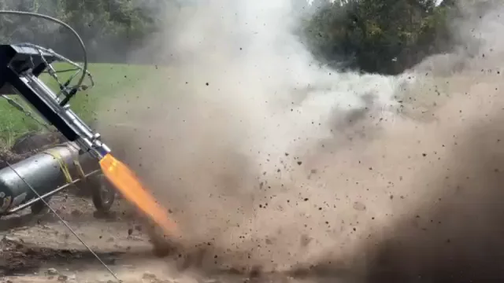

# GAR-E and Spender

GAR-E was MACH's ethanol and nitrous oxide engine. Spender was the plumbing, tanks, valves and controls used to supply and test it. The system progressed from inert flows and ignition failures to sustained in-chamber combustion with New GAR-E in August 2024.

[See the full MACH timeline, including Spender's component and pressure tests](../timeline/){ .md-button }

## Test campaigns

  <article>
    
    

      <time datetime="2024-09-29">September 28–29, 2024</time>
      <h2><a href="hotfire-2024-09-28/">Final New GAR-E campaign</a></h2>
      
The engine reached about 1.07 kN before the graphite nozzle separated during the September 29 hot fire.

    

  </article>
  <article>
    
    

      <time datetime="2024-08-22">August 20–22, 2024</time>
      <h2><a href="hotfire-2024-08-22/">Launch Canada sustained hot fire</a></h2>
      
MACH's first verified sustained in-chamber combustion, followed by evidence of injector maldistribution and burn-through.

    

  </article>
  <article>
    
    

      <time datetime="2024-07-14">July 14, 2024</time>
      <h2><a href="coldflow-2024-07-14/">New GAR-E injector cold flows</a></h2>
      
Two flows characterized the 12-orifice injector and found excess fuel-volute pressure loss.

    

  </article>
  <article>
    
    

      <time datetime="2023-11-19">November 18–19, 2023</time>
      <h2><a href="hotfire-2023-11-19/">Integrated liquid-propellant ignition</a></h2>
      
Combustion formed downstream near the throat rather than anchoring inside the chamber.

    

  </article>
  <article>
    
    

      <time datetime="2023-08-31">August 30–September 1, 2023</time>
      <h2><a href="hotfire-2023-08-30/">Launch Canada ignition attempt</a></h2>
      
Propellant delivery and abort controls worked, but the propellants did not ignite.

    

  </article>
  <article>
    
    

      <time datetime="2023-08-19">August 19–20, 2023</time>
      <h2><a href="coldflow-2023-08-19/">Pre-Launch Canada cold flows</a></h2>
      
One water and two CO₂ injector flows. GUI and telemetry faults limited analysis.

    

  </article>

