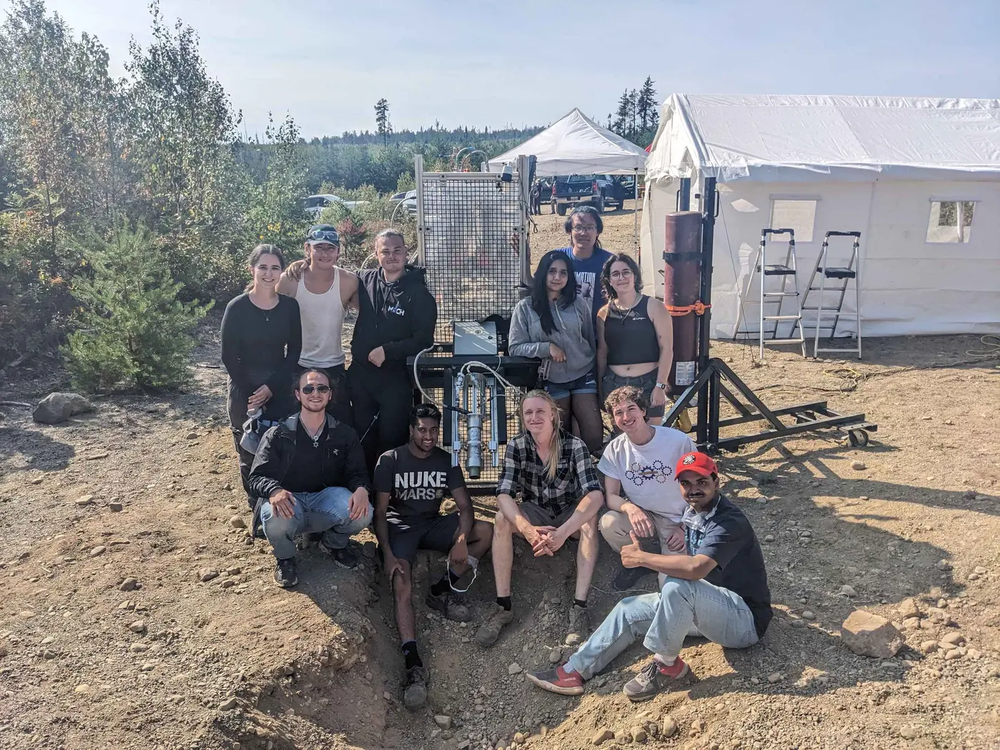
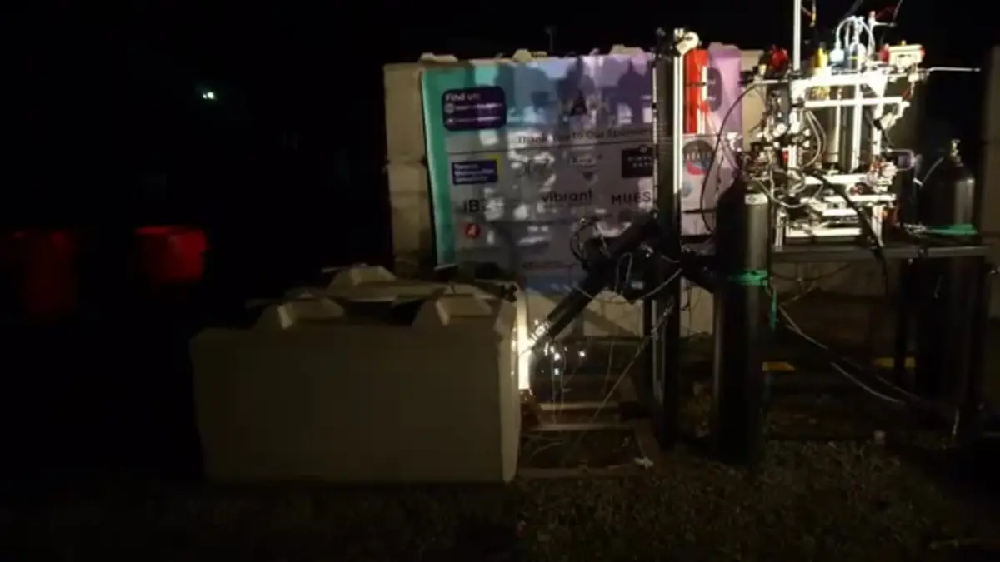
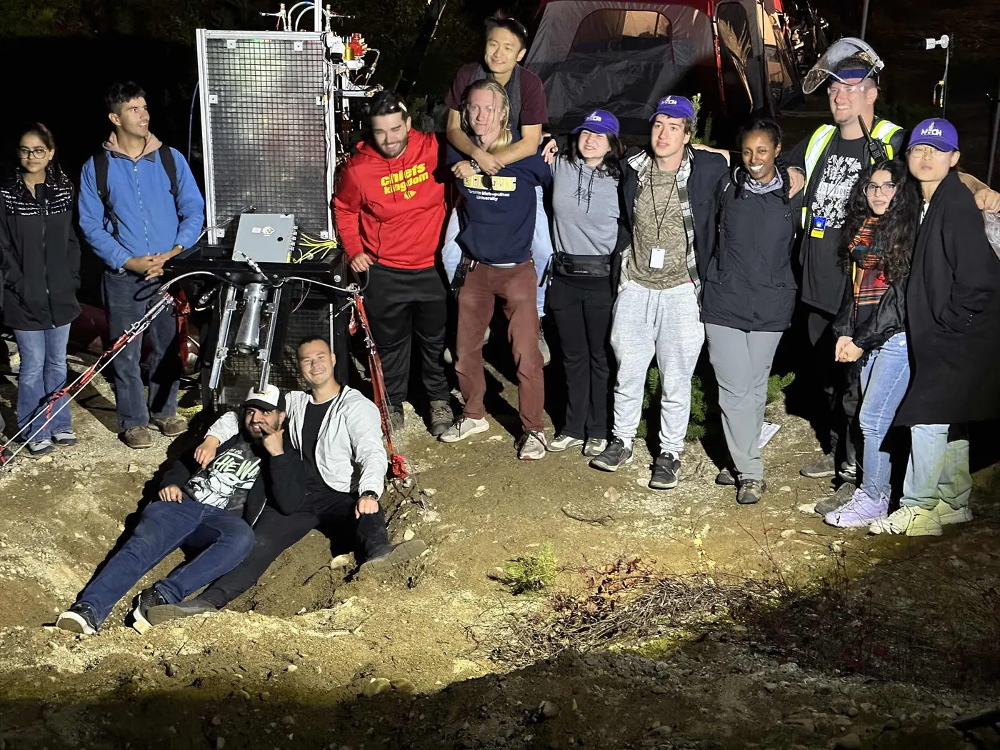

# GAR-E

GAR-E was MACH's nitrous oxide and ethanol liquid rocket engine program. The archive below covers the team's cold-flow and hot-fire campaigns from August 2023 through September 2024.

## Tests

  

    
    <h3>Hot Fire Test - September 28th, 2024</h3>
    
Successful final GAR-E hot fire.

    <a href="hotfire-2024-09-28/" class="find-out-more">Find out more →</a>
  

  

    
    <h3>Hot Fire Test - August 22nd, 2024</h3>
    
Successful GAR-E hot fire at Launch Canada 2024.

    <a href="hotfire-2024-08-22/" class="find-out-more">Find out more →</a>
  

  

    
    <h3>Cold Flow Test - July 14th, 2024</h3>
    
Cold-flow characterization of the new injector and thrust chamber.

    <a href="coldflow-2024-07-14/" class="find-out-more">Find out more →</a>
  

  

    
    <h3>Hot Fire Attempt - November 19th, 2023</h3>
    
Ignition test and hot-fire attempt with recorded pressure data.

    <a href="hotfire-2023-11-19/" class="find-out-more">Find out more →</a>
  

  

    
    <h3>Hot Fire Attempt - August 30th, 2023</h3>
    
GAR-E's first Launch Canada hot-fire attempt.

    <a href="hotfire-2023-08-30/" class="find-out-more">Find out more →</a>
  

  

    
    <h3>Cold Flow Test - August 19th–20th, 2023</h3>
    
GAR-E cold-flow test campaign.

    <a href="coldflow-2023-08-19/" class="find-out-more">Find out more →</a>
  

