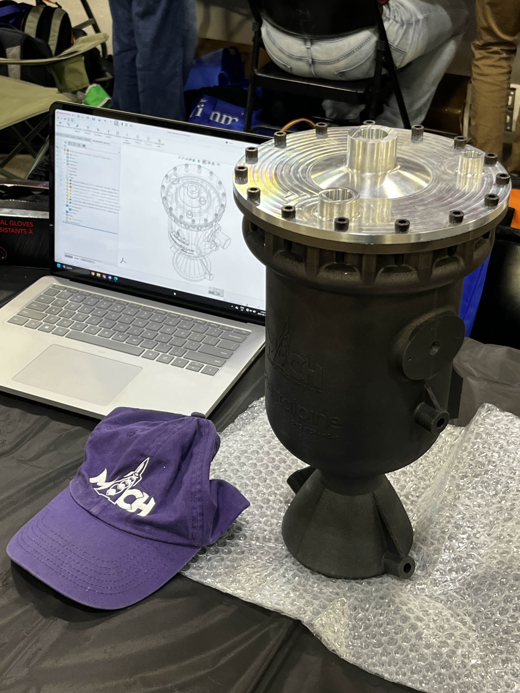
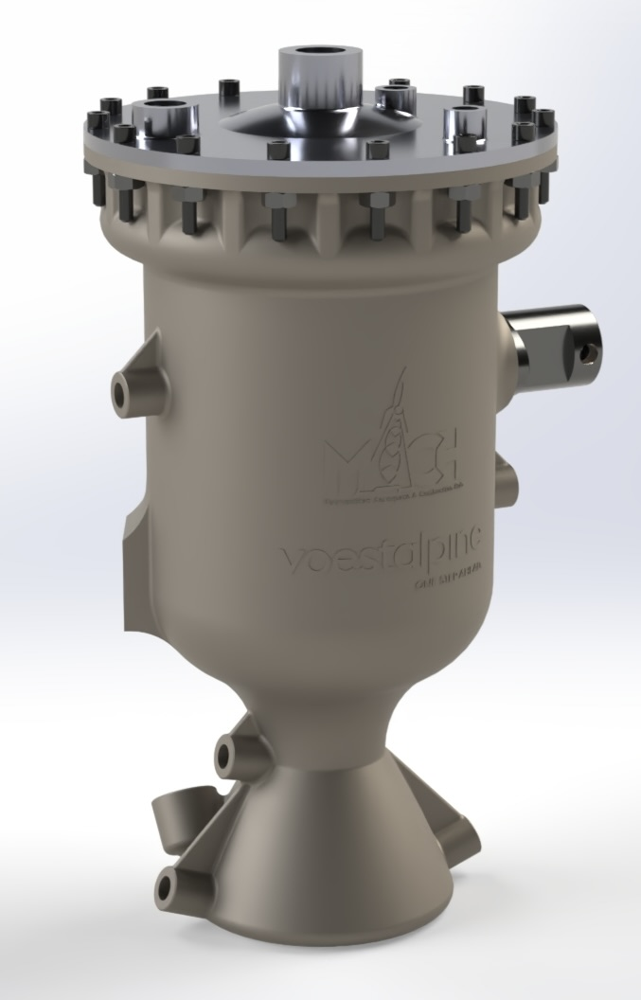

# SABRE

Our newest engine SABRE (Student Additive Bi-propellant Regen Engine) Is the largest student research and developed regenerative rocket engine in Canada. Project SABRE operates as a pressure fed rocket engine using nitrogen as pressurant. The fuel and oxidizer for SABRE are ethanol and nitrous oxide respectfully.  The ethanol fuel is the coolant for the engine's combustion chamber with a total of 17 geometrically dynamic cooling channels. The rocket engine has 6.3kN of thrust (~1400lbf), weighs approximately 6.5kg (~14.33lbs). Mach is very proud to have Voelstalpine is a major partner in project SABRE. Our engine is additively manufactured out of Voelstalpine's BÖHLER L718 metal powder, making it the first SRAD (Student Researched and Developed) Inconel engine in Canada.

Project SABRE is a multi year long project for our team. This year, our SABRE test campaign will begin with a short duration hotfire to gather data on our engine. With a better understanding of SABRE's real engine performance, we will prepare for a long duration hotfire of 30+ seconds and integrate a thrust vectoring system (TVC) and a torch ignition system. We plan to showcase the full potential of project SABRE at next year's Launch Canada in 2026.

    
    

