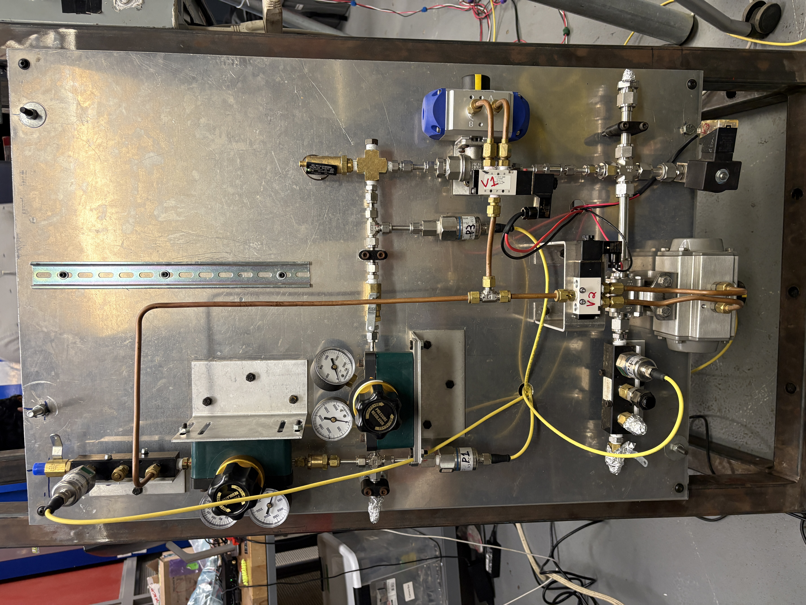

# Plumbing

Plumbing System Overview

## Fill and Purge System

Our system employs both high- and low-pressure nitrogen regulators. One for pneumatics and one for purge. Each subsystem is instrumented with dedicated pressure transducers. The pneumatic control architecture provides reliable, rapid actuation. Valves are spring-biased to ensure failsafe default positions. We adhere to industry-standard practices, utilizing Swagelok, AN, and NPT fittings.

