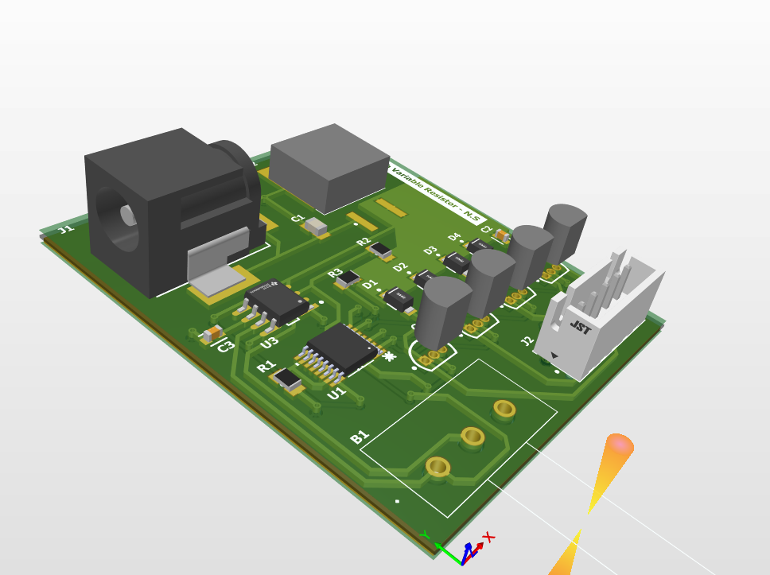
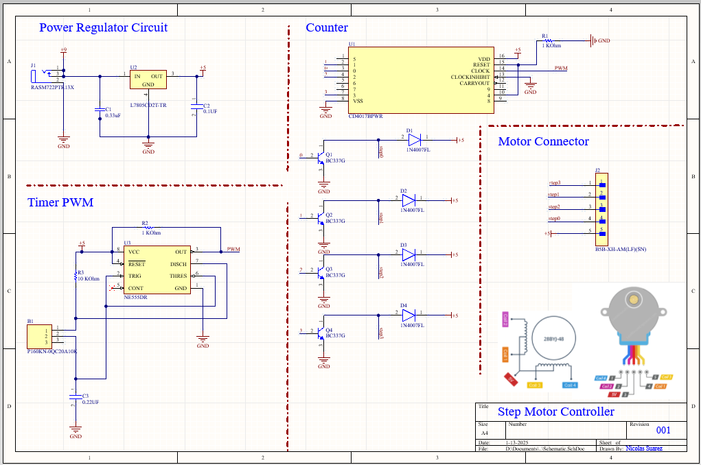
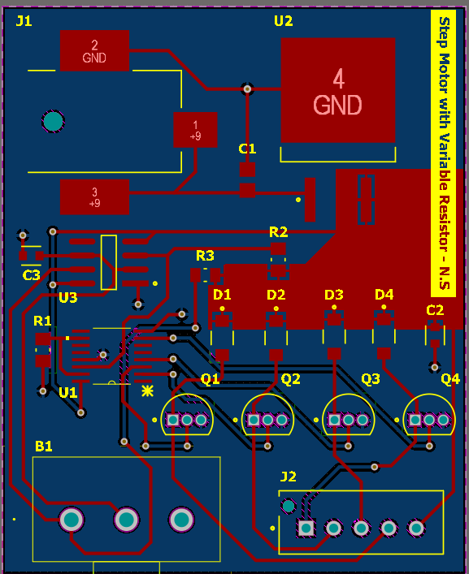
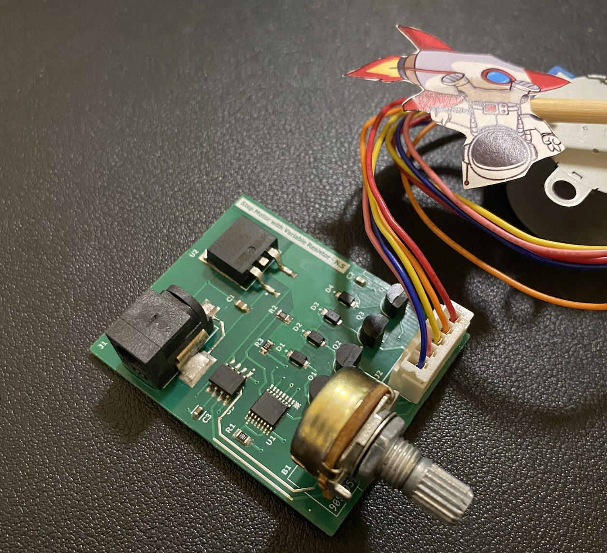

# Step Motor With Variable Resistor

**By: Nicholas Suarez.** [Altium Files](nicholas/altium.zip)

<video controls preload="metadata" playsinline src="/SPRINT/avionics/archive/Open-Challenges-Archive/winter-2024-2025-avionics-challenge/participants/nicholas/vid.mp4" poster="/SPRINT/avionics/archive/Open-Challenges-Archive/winter-2024-2025-avionics-challenge/participants/nicholas/video-poster.jpg" aria-label="Nicholas's avionics challenge demonstration"></video>

[Download BOM](nicholas/bom.csv)

