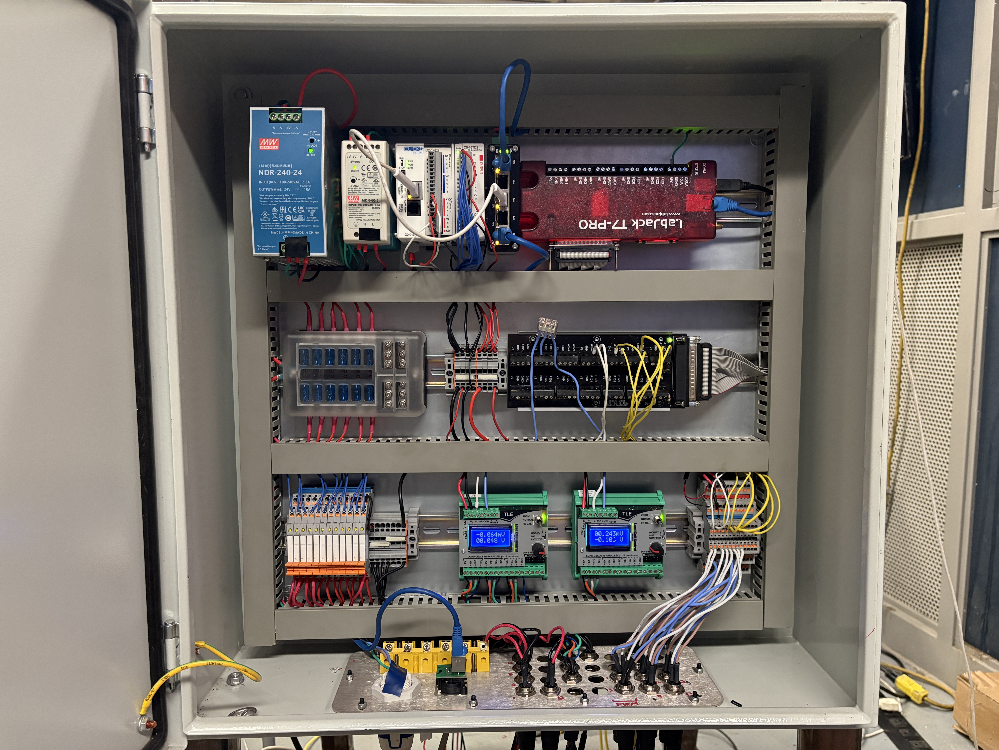

# Electronics

## Description

The primary function of the Ground Support Equipment (GSE) is to collect telemetry and control the bi-propellant liquid rocket safely using a standardized, reliable electrical enclosure.

Enclosure and connectors: The enclosure houses all critical hardware. It is IP65-rated for dust and water protection appropriate for launch pad conditions and employs IP67-rated connectors to ensure sealed, reliable interconnects.

Instrumentation and control: A LabJack T7-Pro provides high‑resolution analog acquisition (thermocouples, pressure transducers, and load cells), while the CLICK PLUS C2-01CPU PLC delivers deterministic control of relays and PWM‑driven servos for valve actuation.

Networking and software: All devices are routed through a hardened Gigabit Ethernet switch enabling remote software operation with manual override and integrated fail‑safes for mission‑critical functions.

Additional capabilities: The system incorporates mechanical and solid‑state relays, fused power distribution, and organized terminal blocks to simplify maintenance and ensure electrical protection.

## Top Row

- [Mean Well NDR-240-24 240W 24VDC 10A AC/DC](https://www.amazon.ca/dp/B09K5K5R48?ref=ppx_yo2ov_dt_b_fed_asin_title&th=1)
- [MEAN WELL MDR-60-5 AC to DC DIN-Rail Power Supply 5V 10 Amp 50W ](https://www.amazon.ca/dp/B005T6SAJI?ref=ppx_yo2ov_dt_b_fed_asin_title)
- [C2-01CPU CLICK PLUS PLC](https://www.automationdirect.com/adc/shopping/catalog/programmable_controllers/click_plus_plcs_(stackable_micro_modular)/cpus/c2-01cpu)
- [C2-14D2](https://www.automationdirect.com/adc/shopping/catalog/programmable_controllers/click_plus_plcs_(stackable_micro_modular)/cpu_option_slot_modules/c2-14d2)
- [Steloproad Mini Industrial 5 Ports Gigabit Switch Hardened 5 Port RJ45 10/100/1000Mbps Ethernet Switch](https://www.amazon.ca/dp/B09WY79QBM?ref=ppx_yo2ov_dt_b_fed_asin_title&th=1)
- [LabJack T7-Pro](https://labjack.com/products/labjack-t7-pro)

## Middle Row

- Random fuse box (VHB taped to din rail lol)
- Random terminals, ground and 24V
- Labjack breakout

## Bottom Row

- [Relays](https://www.digikey.ca/en/products/detail/phoenix-contact/2903361/4755334)
- Load Cell Amps
- [13x 3 layer terminal blocks](https://www.digikey.ca/en/products/detail/phoenix-contact/3213713/3603867)