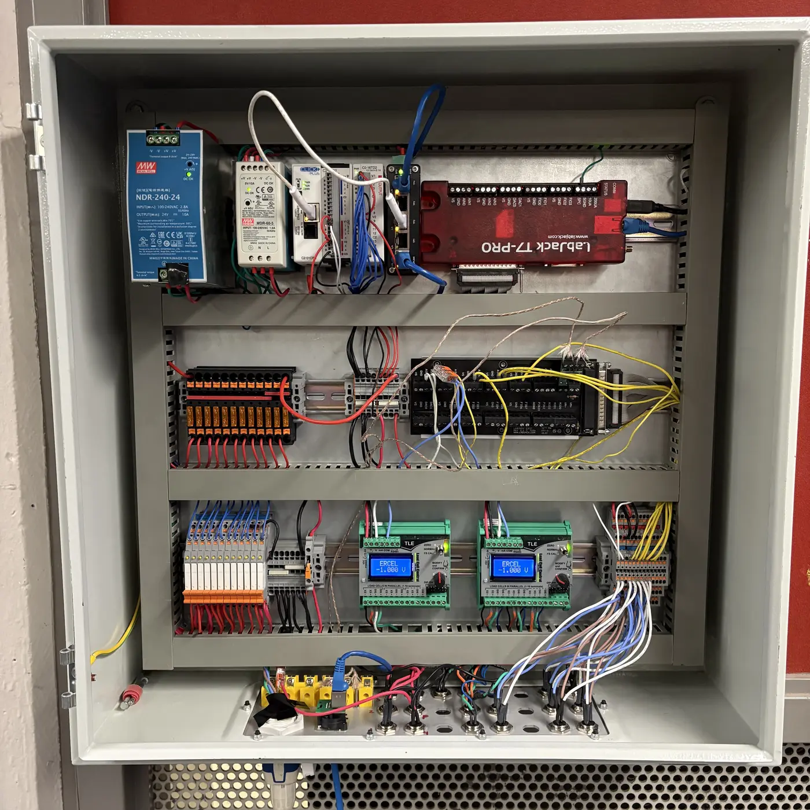

---
hide:
  - navigation
  - path
  - footer
---

# SPRINT Electronics

## Hardware

Electrical Ground Support Equipment (EGSE)

### Enclosure

- [VEVOR Steel Electrical Box 24'' x 24'' x 8'' ](https://www.vevor.ca/electrical-enclosure-c_10749/vevor-steel-electrical-box-electrical-enclosure-box-24x24x8-carbon-steel-ip65-p_010590231787?utm_source=email&utm_medium=emailnotice&utm_campaign=en_CA_orderDelivery_2025-06-09_23-24-50). Both latches broke so we replaced them. The hinges seem fine.

### Bottom Panel

- [Custom bottom panel from SendCutSend](https://cad.onshape.com/documents/0c03de3f9e7910fd1817c74c/w/839331d5ea26310bf6a065d9/e/913649c37274f5204784182b?renderMode=0&uiState=692b76cdd383de71500c5b16)

- [Ethercon](https://www.mouser.com/ProductDetail/Neutrik/NE8FDP-TOP?qs=gZXFycFWdAPZSXS%252BNdoDvg%3D%3D&countryCode=CA&currencyCode=CAD)

- [Power](https://www.digikey.ca/en/products/detail/schurter-inc/4312-0013/9094669) Not gonna use this on the next version, already broke one of the latches on it. [This one next time](https://www.digikey.ca/en/products/detail/schurter-inc/3-153-699/26775310) (or maybe without the switch because panel space is limited)

- Valve, load cell and pressure transducer: [Panel](https://www.digikey.ca/en/products/detail/te-connectivity-amp-connectors/T4132012051-000/8854114) and [wire](https://www.digikey.ca/en/products/detail/te-connectivity-amp-connectors/T4110001051-000/6679522). In different pin numbers. These are quite large, and we're running out of room. 

- Unsure which thermocouple panel connector we're using.

### Top Row

- [Mean Well NDR-240-24 240W 24VDC 10A AC/DC](https://www.amazon.ca/dp/B09K5K5R48?ref=ppx_yo2ov_dt_b_fed_asin_title&th=1)
- [MEAN WELL MDR-60-5 AC to DC DIN-Rail Power Supply 5V 10 Amp 50W ](https://www.amazon.ca/dp/B005T6SAJI?ref=ppx_yo2ov_dt_b_fed_asin_title)
- [C2-01CPU CLICK PLUS PLC](https://www.automationdirect.com/adc/shopping/catalog/programmable_controllers/click_plus_plcs_(stackable_micro_modular)/cpus/c2-01cpu)
- [C2-14D2](https://www.automationdirect.com/adc/shopping/catalog/programmable_controllers/click_plus_plcs_(stackable_micro_modular)/cpu_option_slot_modules/c2-14d2)
- [Steloproad Mini Industrial 5 Ports Gigabit Switch Hardened 5 Port RJ45 10/100/1000Mbps Ethernet Switch](https://www.amazon.ca/dp/B09WY79QBM?ref=ppx_yo2ov_dt_b_fed_asin_title&th=1)
- [LabJack T7-Pro](https://labjack.com/products/labjack-t7-pro)

### Middle Row

- [Blade fuse terminals](https://www.digikey.ca/en/products/detail/phoenix-contact/3212166/12138996)
- Random terminals, ground and 24V
- [Labjack breakout](https://labjack.com/products/cb37-terminal-board)

### Bottom Row

- [Relays](https://www.digikey.ca/en/products/detail/phoenix-contact/2903361/4755334)
- [2x Load Cell Amplifiers](https://www.800loadcel.com/electronics/signal-conditioners/tle-load-cell-amplifier.html)
- [13x 3 layer terminal blocks](https://www.digikey.ca/en/products/detail/phoenix-contact/3213713/3603867)

## LabVIEW 

Front panel view of LabVIEW

Back panel (block diagram)

