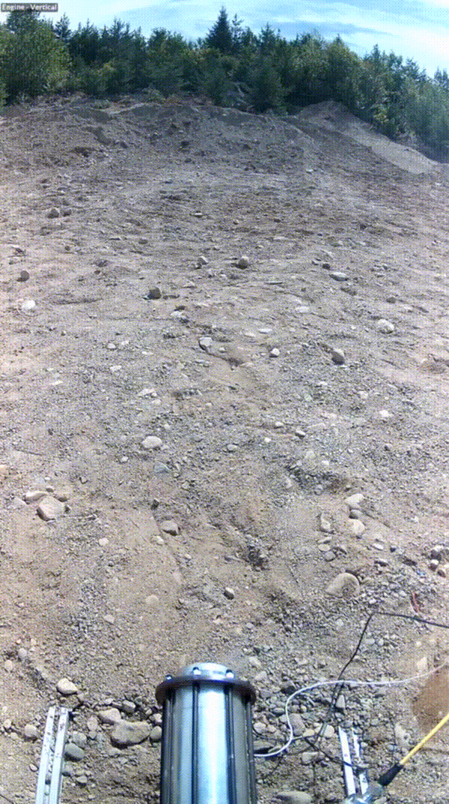
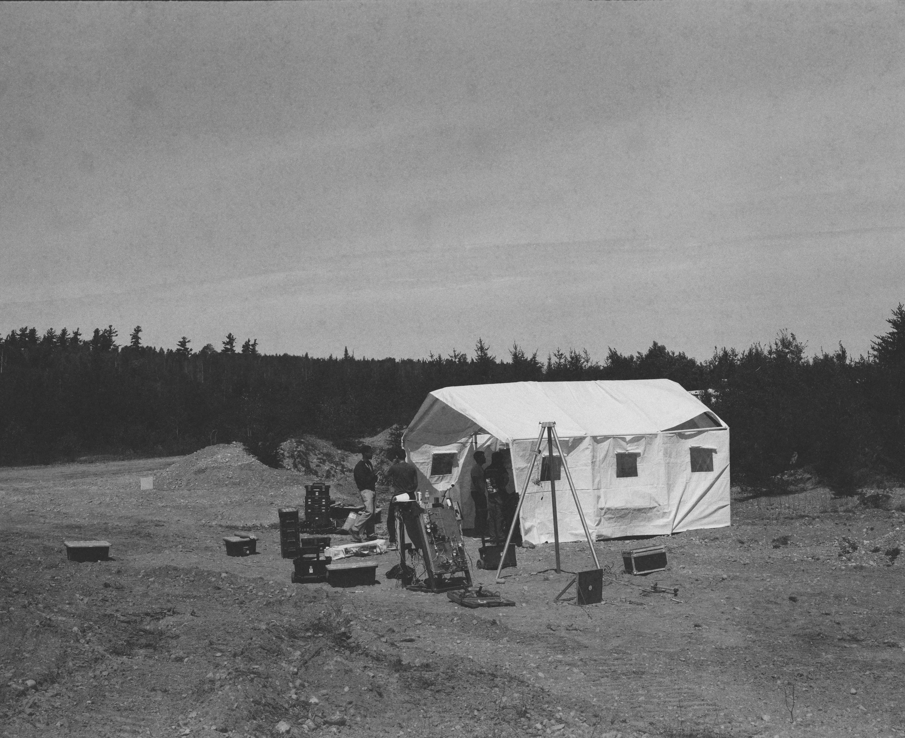
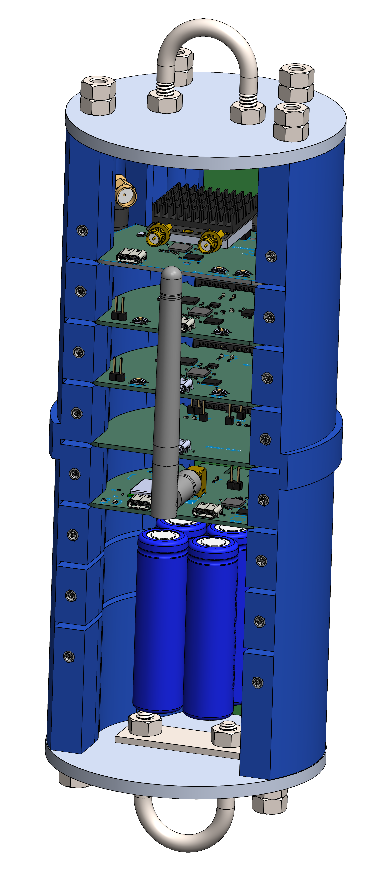
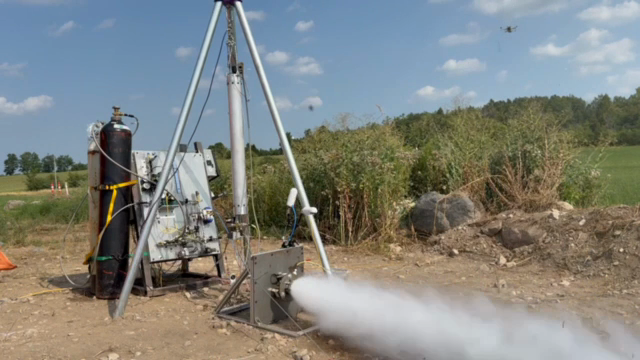

---
hide:
  - toc
  - navigation
---

# SPRINT

    
    

        
SPRINT is a project that officially began just one month prior to its first hotfire at Launch Canada.

        
SPRINT's modular architecture supports quick configuration changes, efficient testing, and fast learning. The results of our hotfire puts us on track to flying our flight-weight system now in development.

    

<!-- 

    
    
Complete SPRINT system overview showing integrated test setup and components

 -->

## Subsystems

    
    

        
        <h3>Propulsion</h3>
        
Feed system, valves, and fluid dynamics for the liquid bipropellant engine. Features pneumatic control architecture with fail-safe valve positions and industry-standard fittings.

        <a href="subsystems/propulsion/" class="find-out-more">Learn more →</a>
    

    
    

        
        <h3>Electrical</h3>
        
Ground support equipment for data acquisition and rocket control. IP65-rated enclosure with LabJack T7-Pro, PLC, and LabVIEW HMI for safe operations.

        <a href="subsystems/electronics/" class="find-out-more">Learn more →</a>
    

    
    

        
        <h3>Avionics</h3>
        
Flight computer and sensor modules for the 4" rocket system. Custom PCB modules for power, telemetry, recovery, GPS, and sensor acquisition.

        <a href="subsystems/avionics/" class="find-out-more">Learn more →</a>
    

    
    <!-- 

        
        <h3>Structures</h3>
        
Mechanical framework components including rocket airframe, engine mounts, and recovery bay assemblies. Designs prioritize safety, manufacturability, and integration.

        <a href="subsystems/structures/" class="find-out-more">Learn more →</a>
    

    
    

        
        <h3>Media & Logistics</h3>
        
Operations support through documentation, safety management, event coordination, and public outreach. Enabling successful rocket development through communication and organization.

        <a href="subsystems/media-logistics/" class="find-out-more">Learn more →</a>
    
 -->

## Tests

    

        
        <h3>Hot Fire Test - September 13th & 14th, 2025</h3>
        
Multi-day hot-fire test campaign demonstrating improved engine performance and system reliability across multiple firing sequences.

        <a href="tests/sept-13-14-hotfire/" class="find-out-more">Find out more →</a>
    

    

        
        <h3>Hot Fire Test - August 22nd, 2025</h3>
        
Hot-fire test of the SPRINT system demonstrating successful ignition and combustion.

        <a href="tests/hotfire/" class="find-out-more">Find out more →</a>
    

    
    

        
        <h3>Cold Flow Test - August 9th, 2025</h3>
        
Cold-flow test validating fluid dynamics and system integration.

        <a href="tests/coldflow/" class="find-out-more">Find out more →</a>
    

<!-- ## Links

- [BOM](https://docs.google.com/spreadsheets/d/14efr8l9_zVHHuwc9b49hxxgiD6_vnU3ExFUFa4B9Yjg/edit?usp=sharing)

- [CAD](https://github.com/marstmu/4in-liquid-rocket)

## Documents

- Mojave Sphinx book: [HCR-5100](HCR-5100%20-%20Mojave%20Sphinx%20Build,%20Integration,%20and%20Launch%20Guidebook%20-%20R01-2.pdf)

- [FAR-OUT Rules](FAR-OUT+Rules+and+Requirements+Document+rev+2024-10-02.pdf)

- Launch Canada 
    - [Design, Test & Evaluation Guide](Launch+Canada+Design,+Test+&+Evaluation+Guide+R3+(2).pdf)
    - [2025 Rules & Requirements Guide](Launch+Canada+Rules+and+Requirements+Guide+2025R3.pdf) -->