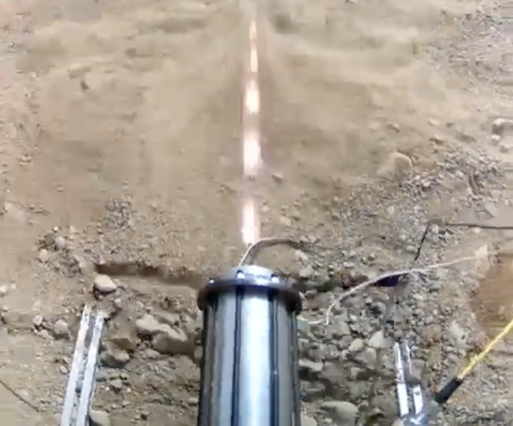

---
hide:
  - toc
---

# SPRINT

## Tests

    
    

        
        <h3>Hot Fire Test - 2024</h3>
        
Hot-fire test of the SPRINT system demonstrating successful ignition and combustion.

        <a href="hotfire_2024/" class="find-out-more">Find out more →</a>
    

    
    

        
        <h3>Cold Flow Test - 2024</h3>
        
Cold-flow test validating fluid dynamics and system integration.

        <a href="coldflow_2024/" class="find-out-more">Find out more →</a>
    

<!-- ## Links

- [BOM](https://docs.google.com/spreadsheets/d/14efr8l9_zVHHuwc9b49hxxgiD6_vnU3ExFUFa4B9Yjg/edit?usp=sharing)

- [CAD](https://github.com/marstmu/4in-liquid-rocket)

## Documents

- Mojave Sphinx book: [HCR-5100](HCR-5100%20-%20Mojave%20Sphinx%20Build,%20Integration,%20and%20Launch%20Guidebook%20-%20R01-2.pdf)

- [FAR-OUT Rules](FAR-OUT+Rules+and+Requirements+Document+rev+2024-10-02.pdf)

- Launch Canada 
    - [Design, Test & Evaluation Guide](Launch+Canada+Design,+Test+&+Evaluation+Guide+R3+(2).pdf)
    - [2025 Rules & Requirements Guide](Launch+Canada+Rules+and+Requirements+Guide+2025R3.pdf) -->