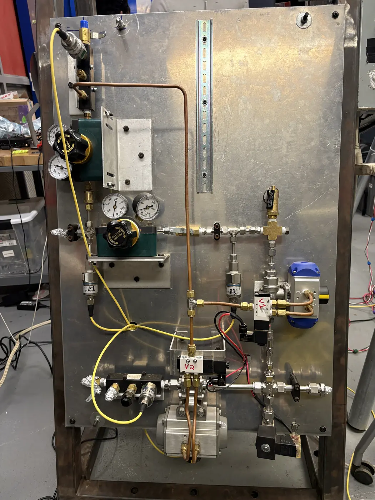
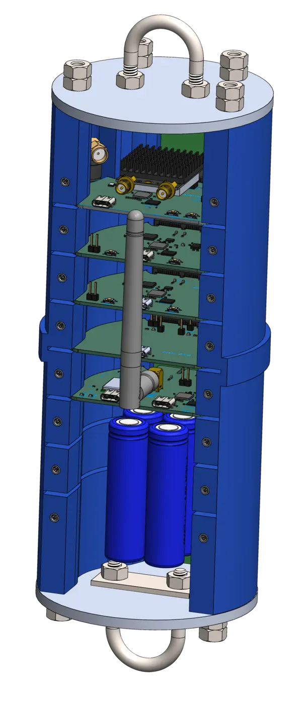
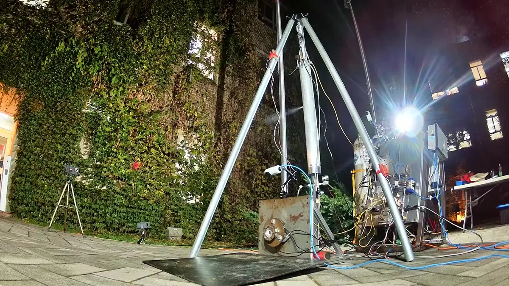
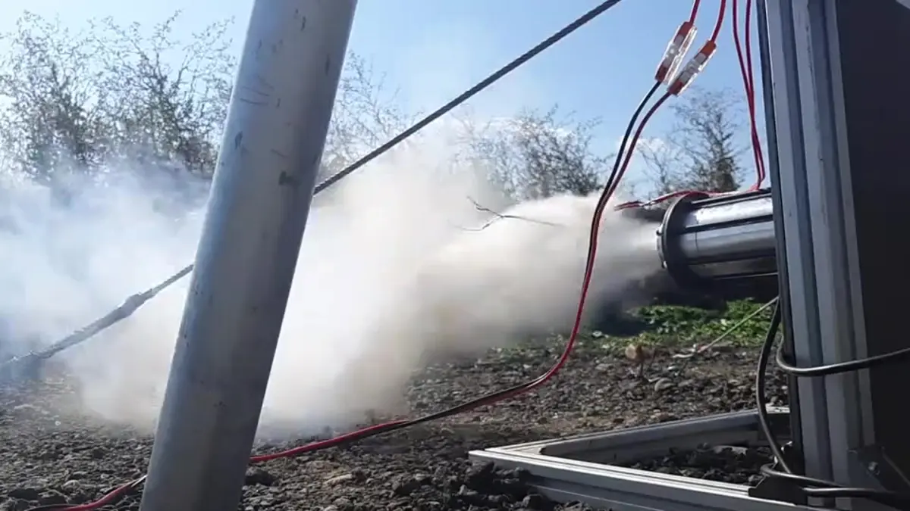

---
hide:
  - toc
  - navigation
---

# SPRINT

    <video class="hero-gif" autoplay muted loop playsinline preload="metadata" poster="aug-22-hotfire/test-video-poster.jpg" aria-label="SPRINT hot fire on August 22nd, 2025">
      <source src="aug-22-hotfire/firing.mp4" type="video/mp4">
    </video>
    

        
SPRINT is a project that officially began just one month prior to its first hotfire at Launch Canada.

        
SPRINT's modular architecture supports quick configuration changes, efficient testing, and fast learning. The results of our hotfire puts us on track to flying our flight-weight system now in development.

    

## Systems

    

        
        <h3>Propulsion</h3>
        
Feed-system plumbing, ground-support equipment, and quick-disconnect testing.

        <a href="propulsion/" class="find-out-more">Find out more →</a>
    

    

        
        <h3>Electronics</h3>
        
Electrical ground-support hardware and the LabVIEW control interface.

        <a href="electronics/" class="find-out-more">Find out more →</a>
    

    

        
        <h3>Avionics</h3>
        
Flight computers, sensors, power, telemetry, and recovery electronics.

        <a href="avionics/" class="find-out-more">Find out more →</a>
    

## Tests

    

        
        <h3>Hot Fire Test - December 15th & 16th, 2025</h3>
        
Hot fire test campaign demonstrating engine performance and system integration over two days.

        <a href="dec-15-16-hotfire/" class="find-out-more">Find out more →</a>
    

    

        
        <h3>Cold Flow Test - November 20th, 2025</h3>
        
Cold-flow test of the SPRINT system.

        <a href="nov-20-coldflow/" class="find-out-more">Find out more →</a>
    

    

        
        <h3>Cold Flow Test - November 7th, 2025</h3>
        
Cold-flow test of the SPRINT system.

        <a href="nov-7-coldflow/" class="find-out-more">Find out more →</a>
    

    

        
        <h3>Hot Fire Test - September 13th & 14th, 2025</h3>
        
Multi-day hot-fire test campaign demonstrating improved engine performance and system reliability across multiple firing sequences.

        <a href="sept-13-hotfire/" class="find-out-more">Find out more →</a>
    

    

        
        <h3>Hot Fire Test - August 22nd, 2025</h3>
        
Hot-fire test of the SPRINT system demonstrating successful ignition and combustion.

        <a href="aug-22-hotfire/" class="find-out-more">Find out more →</a>
    

    

        
        <h3>Cold Flow Test - August 9th, 2025</h3>
        
Cold-flow test validating fluid dynamics and system integration.

        <a href="aug-19-coldflow/" class="find-out-more">Find out more →</a>
    

<!-- ## Links

- [BOM](https://docs.google.com/spreadsheets/d/14efr8l9_zVHHuwc9b49hxxgiD6_vnU3ExFUFa4B9Yjg/edit?usp=sharing)

- [CAD](https://github.com/marstmu/4in-liquid-rocket)

## Documents

- Mojave Sphinx book: [HCR-5100](HCR-5100%20-%20Mojave%20Sphinx%20Build,%20Integration,%20and%20Launch%20Guidebook%20-%20R01-2.pdf)

- [FAR-OUT Rules](FAR-OUT+Rules+and+Requirements+Document+rev+2024-10-02.pdf)

- Launch Canada 
    - [Design, Test & Evaluation Guide](Launch+Canada+Design,+Test+&+Evaluation+Guide+R3+(2).pdf)
    - [2025 Rules & Requirements Guide](Launch+Canada+Rules+and+Requirements+Guide+2025R3.pdf) -->
