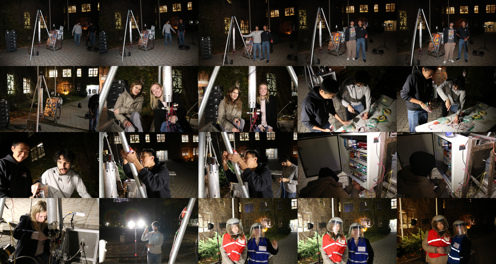

# SPRINT Cold Flow Test - November 20th, 2025

On nov 20th 2025 we did another cold flow. We're still learning a lot when it comes to testing. The software had a major overhaul again and we almost scrubbed the test. 
We pretty much set up with 4 doing the hardware and 2 people setting up mission control. For this test our mission control didn't have to leave our design zone. This test was again less about the data but more about assembling the team and working through integration again. There's a lot of new people and it's not easy to train people and run a test at the same time. So the more we do this the easier it should become. We plan on doing another cold flow on December 11th. We're working towards having the software a truly multi operator workflow. We live streamed on twitch this time to test that out as well. [Here is the debrief](nov-20-coldflow/debrief.md). 

## Test Video

<figure style="margin:2rem auto; display:flex; flex-direction:column; align-items:center; justify-content:center; width:100%; text-align:center;">
  <video controls src="nov-20-coldflow/video.mov" title="SPRINT Cold Flow Test" style="width:100%; max-width:800px; aspect-ratio:16/9; height:auto; border-radius:8px; display:block; margin:0 auto;"></video>
  <figcaption style="font-size:0.9rem; color:#888; margin-top:0.5rem;">November 20th, 2025 cold flow Test 1 video.</figcaption>
</figure>

## Test Data

  <a href="nov-20-coldflow/sprint-nov20-coldflow-data.zip" class="md-button">Download Raw Test Data (.zip)</a>

### Test 1

<figure style="margin:2rem auto; display:flex; flex-direction:column; align-items:center; justify-content:center; width:100%; text-align:center;">
  
  <figcaption style="font-size:0.9rem; color:#888; margin-top:0.5rem;">Data from the first cold flow test on November 20th, 2025.</figcaption>
</figure>

### Test 2

<figure style="margin:2rem auto; display:flex; flex-direction:column; align-items:center; justify-content:center; width:100%; text-align:center;">
  
  <figcaption style="font-size:0.9rem; color:#888; margin-top:0.5rem;">Data from the second cold flow test on November 20th, 2025.</figcaption>
</figure>

## Team Photo

<figure style="margin:2rem auto; display:flex; flex-direction:column; align-items:center; justify-content:center; width:100%; text-align:center;">
  
  <figcaption style="font-size:0.9rem; color:#888; margin-top:0.5rem;">Photos from the cold flow test on November 20th, 2025.</figcaption>
</figure>
