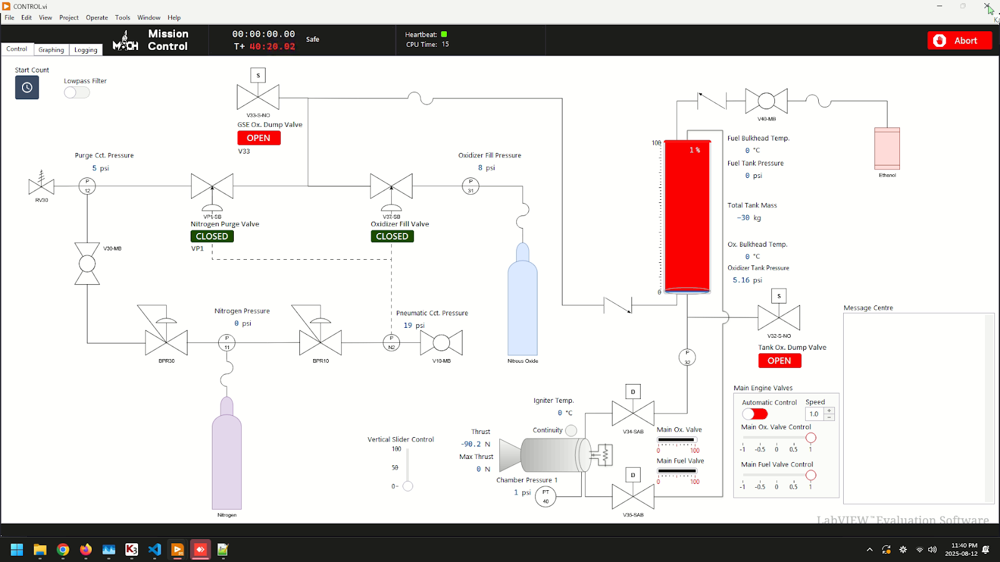
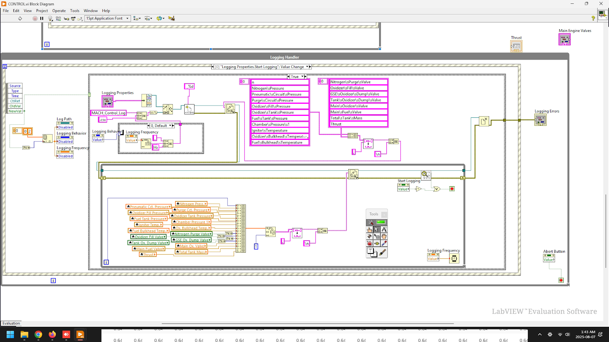

# Ground Software & HMI

Front panel view of LabVIEW

Back panel (block diagram)

## LabVIEW Human-Machine Interface

The LabVIEW HMI provides direct system control through an interactive P&ID schematic, enabling operators to visualize and command valves, sensors, and safety interlocks intuitively. Its architecture follows a fail-safe design paradigm with layered error handling, watchdog sanity checks, and a producer-consumer messaging pattern for deterministic data flow. The interface supports both single and multi-operator workflows within the same executable, preventing resource conflicts while maintaining synchronized state. A modern, high-contrast user interface improves usability in bright outdoor launch conditions and promotes rapid operator familiarity.

## Robust Mission Logging Platform

The logging subsystem records selected parameters and system states either at fixed intervals or immediately upon reception for event-driven fidelity. It runs in an isolated execution context so that logging faults never block primary control functions. All errors are trapped, classified, and reported non-blocking, allowing mission operations to continue while preserving diagnostic detail. Structured log outputs facilitate post-test performance analysis, anomaly investigation, and traceability of command sequences.

## Reliability & Safety Features (Summary)

- Watchdog timers supervise critical loops and trigger safe states on timeout.
- Segregated producer (acquisition) and consumer (UI / logging) loops prevent UI stalls from impacting data capture.
- Graceful degradation ensures partial functionality if non-critical modules fault.
- Configuration profiles enable rapid re-tasking between cold-flow and hot-fire procedures.

## Roadmap (Planned Enhancements)

- Integrated replay mode for post-test timeline reconstruction.
- Automated test script runner with parameter templating.
- WebSocket telemetry bridge for remote dashboard mirroring.
- Inline calibration assistant for pressure and load cell channels.
