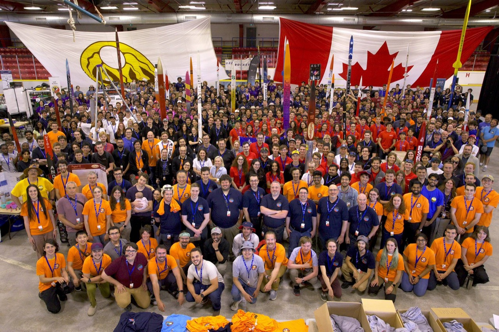
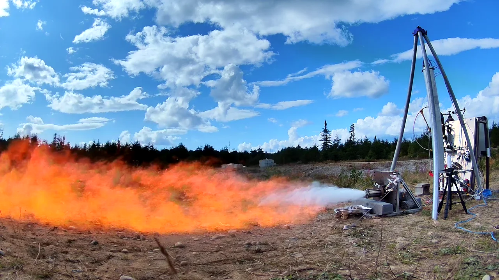
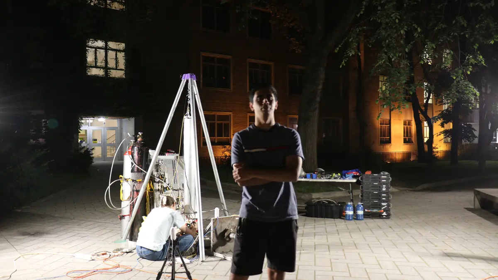
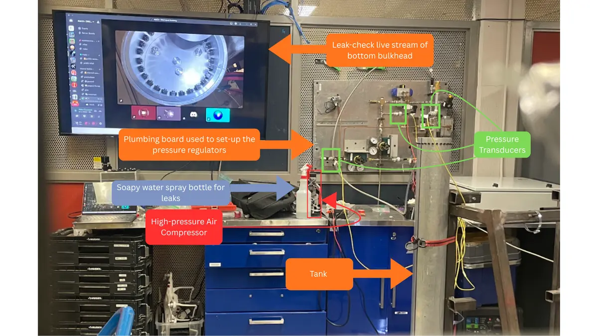

# Seraphina

Seraphina is MACH's project for 2026. It is a complete overhaul of the tank system with automated fueling. At Launch Canada, MACH will be able to press a single button and have the system load both fuel and oxidizer, fire the engine, and safe the pad. The only manual steps will be opening the cylinders and setting the regulators.

[See the complete MACH test timeline](../timeline/){ .md-button }

## Launch Canada 2026

<figure>
  
  <figcaption>All teams gathered at Launch Canada 2026.</figcaption>
</figure>

## Tests

  <article>
    
    

      <time datetime="2026-08-20">August 20, 2026</time>
      <h2><a href="aug-20-hotfire/">Relight test</a></h2>
      
Two hot fires were completed in one uninterrupted remotely commanded sequence. A separate firing from the same day is also documented by video; no telemetry data is available for that firing.

    

  </article>
  <article>
    
    

      <time datetime="2026-08-06">August 6, 2026</time>
      <h2><a href="aug-6-hotfire/">Hot-fire campaign</a></h2>
      
The first attempt did not ignite. The second burned for a reported 8.2 seconds and reached 1,233.28 N and 254.36 psi chamber pressure.

    

  </article>
  <article>
    
    

      <time datetime="2026-07-16">July 16–29, 2026</time>
      <h2><a href="../timeline/seraphina-coldflow-2026-07-16/">Cold flow and subsystem checks</a></h2>
      
The integrated rehearsal exposed plumbing, actuator and servo faults. A follow-up low-pressure check passed; later mini cold flows were reported without individual run logs or telemetry.

    

  </article>
  <article>
    
    

      <time datetime="2026-06-26">June 26, 2026</time>
      <h2><a href="../timeline/seraphina-tank-proof-2026-06-26/">Tank proof test</a></h2>
      
After low-pressure NPT-plug leaks were corrected, the tank held 1,350 psi for 18 minutes with no pressure loss or deformation.

    

  </article>

