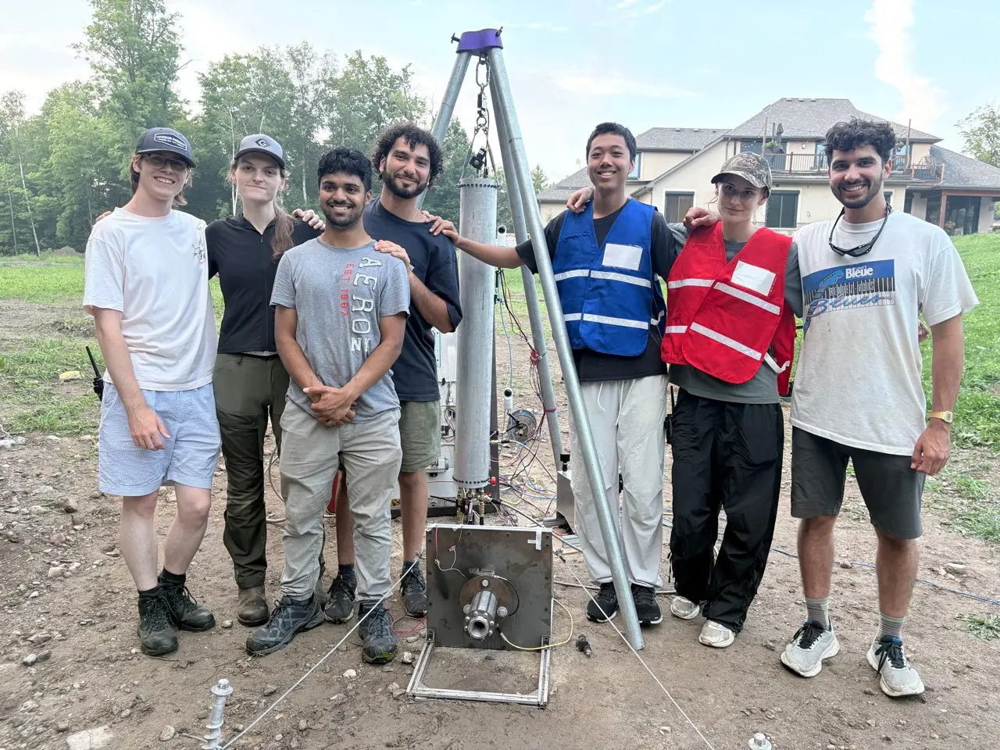

# Seraphina

Seraphina is MACH's project for 2026. It is a complete overhaul of the tank system with automated fueling. At Launch Canada, MACH will be able to press a single button and have the system load both fuel and oxidizer, fire the engine, and safe the pad. The only manual steps will be opening the cylinders and setting the regulators.

## Tests

  

    
    <h3>Hot Fire Test - August 6th, 2026</h3>
    <a href="aug-6-hotfire/" class="find-out-more">Find out more →</a>
  

