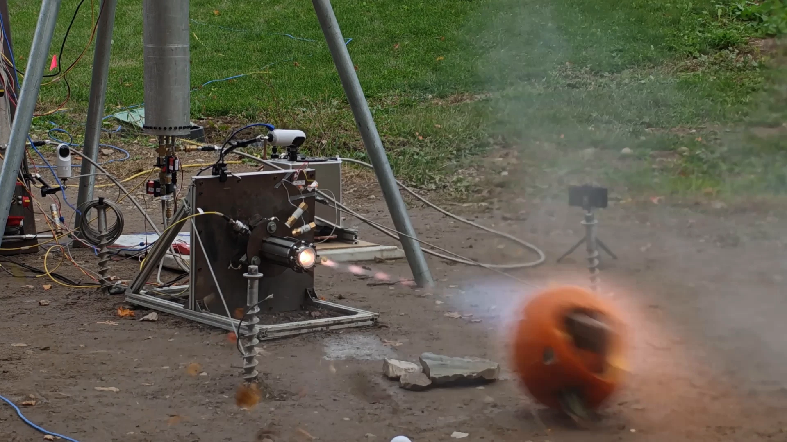
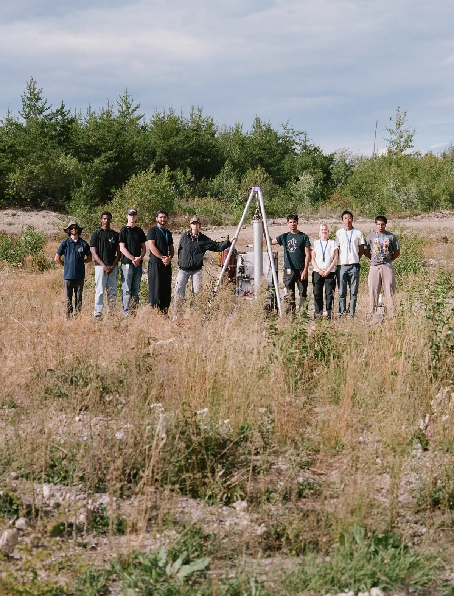
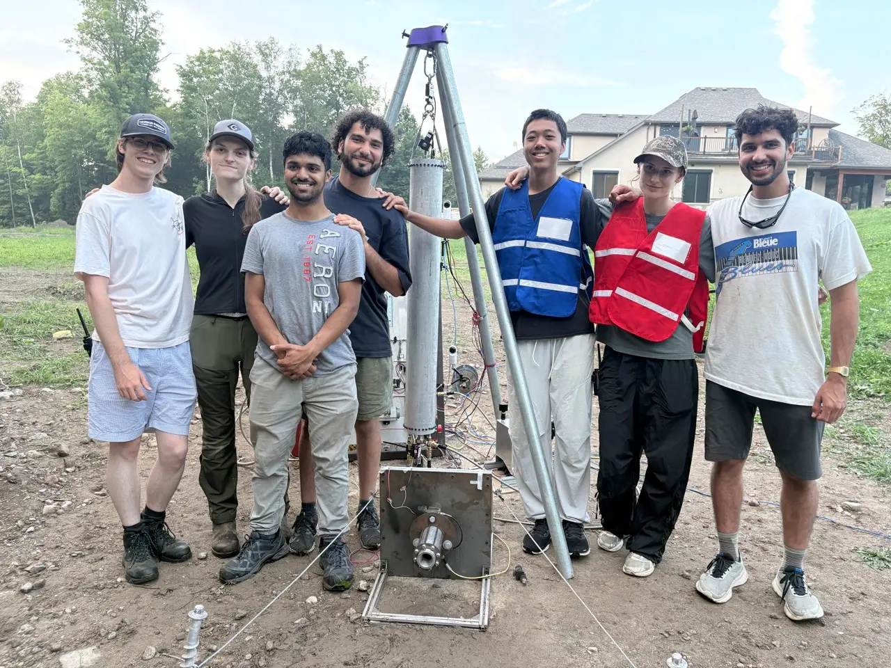
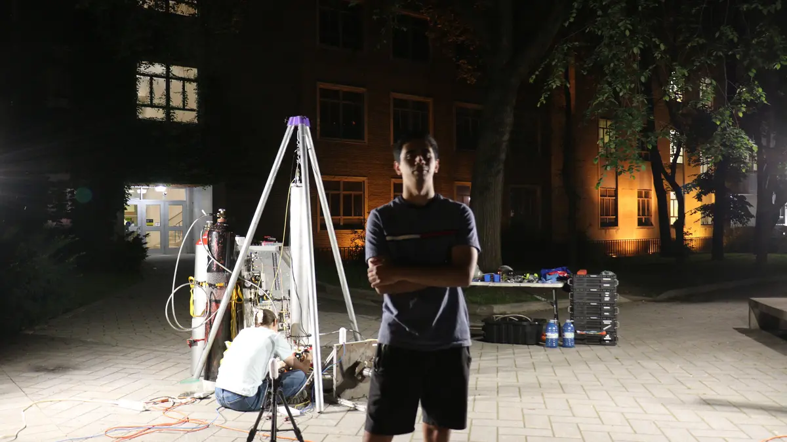
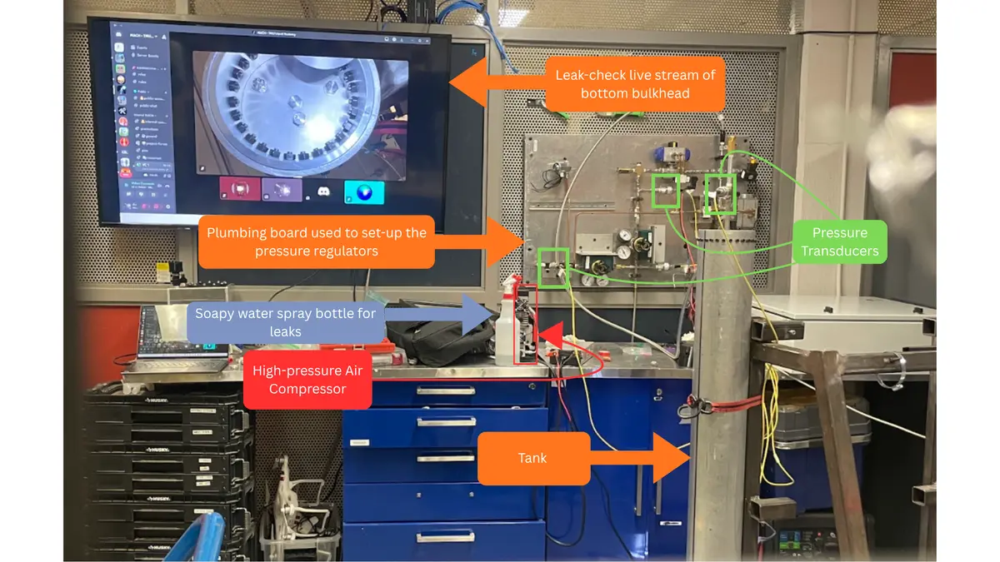

# Seraphina

Seraphina is MACH's project for 2026. It was a complete overhaul of the tank system with automated fueling. At Launch Canada, MACH was able to press a single button and have the system load both fuel and oxidizer, fire the engine, and safe the pad. The only manual steps were opening the cylinders and setting the regulators.

## Tests

  <article>
    
    

      <time datetime="2026-10-04">October 4, 2026</time>
      <h2><a href="oct-4-hotfire/">Hotfire and relight</a></h2>
    

  </article>
  <article>
    
    

      <time datetime="2026-08-20">August 20, 2026</time>
      <h2><a href="aug-20-hotfire/">Relight test</a></h2>
    

  </article>
  <article>
    
    

      <time datetime="2026-08-06">August 6, 2026</time>
      <h2><a href="aug-6-hotfire/">Hot-fire campaign</a></h2>
    

  </article>
  <article>
    
    

      <time datetime="2026-07-16">July 16–29, 2026</time>
      <h2><a href="../timeline/seraphina-coldflow-2026-07-16/">Cold flow and subsystem checks</a></h2>
    

  </article>
  <article>
    
    

      <time datetime="2026-06-26">June 26, 2026</time>
      <h2><a href="../timeline/seraphina-tank-proof-2026-06-26/">Tank proof test</a></h2>
    

  </article>

