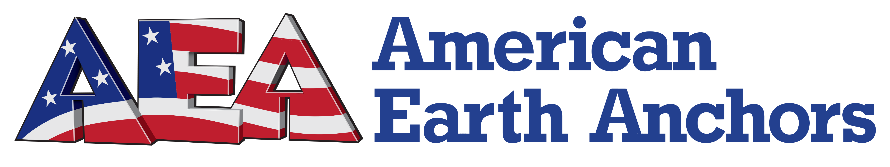

---
hide:
  - navigation
  - toc
---

# Sponsors

MACH is grateful for the support of our sponsors and partners who make our liquid rocketry research and development possible.

    <a href="https://www.americanearthanchors.com/" target="_blank" class="sponsor-item">
        
        American Earth Anchors
    </a>
    
    

        Aqua Environment
    

    
    <a href="https://www.automationdirect.com/" target="_blank" class="sponsor-item">
        
        Automation Direct
    </a>
    
    <a href="https://www.torontomet.ca/dfz/" target="_blank" class="sponsor-item">
        
        Design Fabrication Zone
    </a>
    
    

        Dishon
    

    
    <a href="https://www.flownex.com/" target="_blank" class="sponsor-item">
        
        Flownex
    </a>
    
    <a href="https://www.hoskin.ca/" target="_blank" class="sponsor-item">
        
        Hoskin Scientific
    </a>
    
    <a href="https://www.torontomet.ca/innovation/" target="_blank" class="sponsor-item">
        
        Innovation Boost Zone
    </a>
    
    <a href="https://www.jaksa.com/" target="_blank" class="sponsor-item">
        
        Jaksa Solenoid Valves
    </a>
    
    

        Joseph Wood
    

    
    <a href="https://www.kulite.com/" target="_blank" class="sponsor-item">
        
        Kulite
    </a>
    
    <a href="https://www.launchcanada.org/" target="_blank" class="sponsor-item">
        
        Launch Canada
    </a>
    
    <a href="https://www.marssociety.ca/" target="_blank" class="sponsor-item">
        
        Mars Society of Canada
    </a>
    
    <a href="https://www.megapro.net/" target="_blank" class="sponsor-item">
        
        Megapro
    </a>
    
    <a href="https://theengineering.ca/" target="_blank" class="sponsor-item">
        
        Metropolitan University Engineering Society
    </a>
    
    <a href="https://www.redrocketcoffee.com/" target="_blank" class="sponsor-item">
        
        Red Rocket Coffee
    </a>
    
    

        Simple Path Farms
    

    
    <a href="https://www.solidworks.com/" target="_blank" class="sponsor-item">
        
        Solidworks
    </a>
    
    <a href="https://steinindustries.com/" target="_blank" class="sponsor-item">
        
        Stein Industries Inc
    </a>
    
    <a href="https://www.swagelok.com/" target="_blank" class="sponsor-item">
        
        Swagelok Ontario
    </a>
    
    <a href="https://www.textreme.com/" target="_blank" class="sponsor-item">
        
        TeXtreme
    </a>
    
    <a href="https://www.torontomet.ca/" target="_blank" class="sponsor-item">
        
        Toronto Metropolitan University
    </a>
    
    <a href="https://www.vibrantperformance.com/" target="_blank" class="sponsor-item">
        
        Vibrant Performance
    </a>
    
    <a href="https://www.voestalpine.com/" target="_blank" class="sponsor-item">
        
        voestalpine
    </a>

